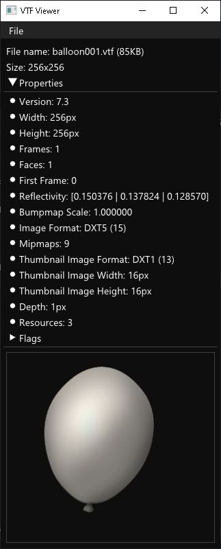
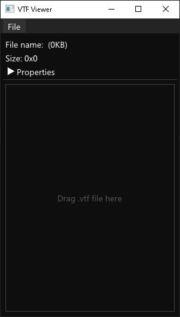

# VTFViewer 
 

A small and lightweight program to quickly open and inspect .VTF files.  
   
**This program was made for inspecting .vtf files, not editing them!**

## Screenshots

 

## How to use

Its very simple. Open a .vtf file with `File -> Open` from the menu or drag and drop a file into the window.

## How to build

VTFViewer uses [premake](https://premake.github.io) as its build system.  
Clone the repository and execute premake in the root folder.

## TODO

- Add multiple mipmap levels
- Image zooming
- Better window layout
- Have open multiple files at the same time

## 3rdParty-Libraries used

[GLFW](https://www.glfw.org)  
[Dear ImGui](https://github.com/ocornut/imgui)  
[nativefiledialog](https://github.com/mlabbe/nativefiledialog)  
[VTFLib](https://github.com/NeilJed/VTFLib)

## License

This project is licensed under the GNU GENERAL PUBLIC LICENSE v3.0!  
See [LICENSE](LICENSE) for more info.
