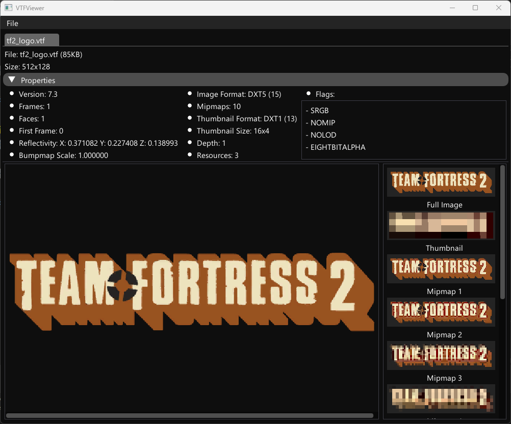

# VTFViewer 

 

A small and lightweight program to quickly open and inspect .VTF files.  
   
**This program was made for inspecting .vtf files, not editing them!**

## Version 2.0!

- New better user interface
- Open multiple .vtf files
- Zoom in and out
- View different mipmap levels

## How to use

Its very simple. Open a .vtf file with `File -> Open` from the menu or drag and drop a file into the window.

**Shift+Scroll** -> Move image left or right  
**Ctrl+Scroll** -> Zoom in and out

## How to build

VTFViewer uses [premake](https://premake.github.io) as its build system.  
Clone the repository and execute premake in the root folder.
[Premake5](premake5.lua)
## Screenshot

## 3rdParty-Libraries used

[GLFW](https://www.glfw.org)  
[Dear ImGui](https://github.com/ocornut/imgui)  
[VTFLib](https://github.com/NeilJed/VTFLib)

## License

This project is licensed under the GNU GENERAL PUBLIC LICENSE v3.0!  
See [LICENSE](LICENSE) for more info.
